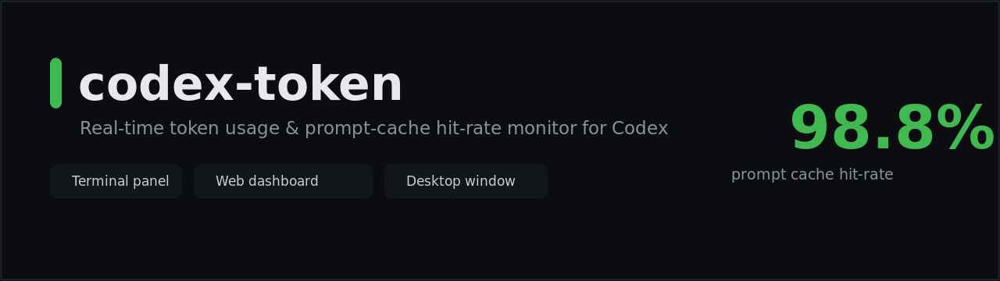
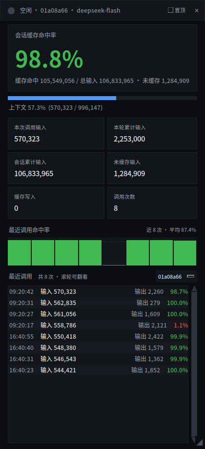
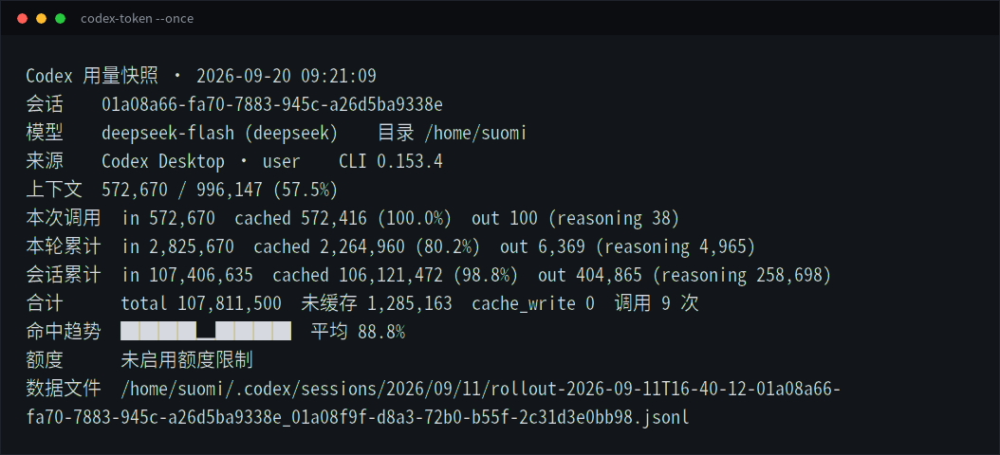
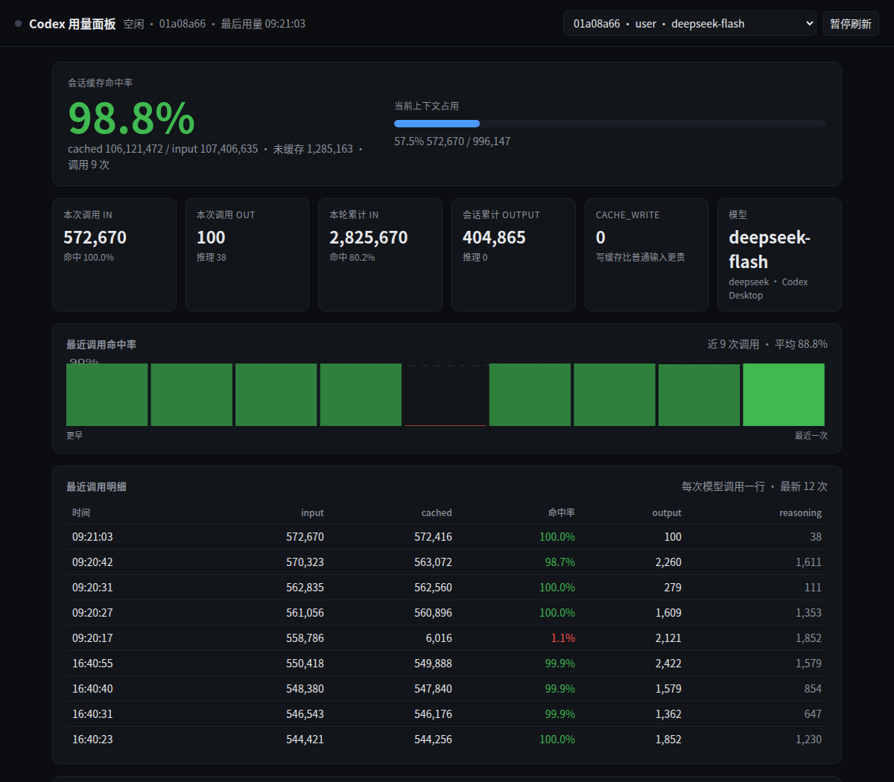

<p align="center">
  
</p>

<p align="center">
  <b>Codex 的实时 token 用量与提示缓存命中率看板</b><br>
  终端面板 &nbsp;·&nbsp; 浏览器看板 &nbsp;·&nbsp; 桌面伴随窗口
</p>

<p align="center">
  
  
  
  
  
</p>

<p align="center">
  <a href="README.md">English</a>
</p>

---

## 为什么需要它

Codex 只给你这样的数字：

```
Token usage: total=138,315  input=137,998 (+ 137,728 cached)  output=187
```

它从不告诉你**这些输入里有多少是真正命中提示缓存的**——而这个比例直接决定你按原价还是按缓存价计费。在 agent 式会话里，每一轮都会重发整个上下文，所以这个比例通常在 95~99%，却全程不可见。

`codex-token` 读取 Codex 自己的会话记录文件，把它实时显示出来：

| 视角 | 看到什么 |
| --- | --- |
| **单次调用** | 最近一次模型调用的命中率，以及最近 40 次的趋势图 |
| **单次会话** | 会话累计命中率、输入 / 命中 / 未缓存 / 输出拆分、调用次数 |
| **跨会话** | 最近所有会话的命中率排行 |

## 界面

**桌面伴随窗口** —— 跟随 Codex 开关，遇到会遮挡别的软件时自动让开：



**终端面板** —— `codex-token --once`，或 `codex-token` 实时刷新：



**浏览器看板** —— 运行 `dashboard-server.mjs`，然后打开 <http://127.0.0.1:8788/>：



## 特点

- **Codex 不显示的那个指标** —— 提示缓存命中率，精确到每次调用
- **一眼发现退化** —— 最近 40 次调用的迷你趋势图，前缀被改动导致的命中率下跌立刻可见
- **三种前端共用一份解析逻辑** —— 终端、浏览器看板、桌面窗口
- **零第三方依赖** —— 只用 Node 内置模块和 Python 标准库，没有 npm/pip 安装步骤
- **只读、离线** —— 读 `~/.codex/sessions/**/rollout-*.jsonl`，不需要凭据、不联网、数据不出本机
- **可脚本化** —— `--json`、`--compact`、`--log calls.jsonl`、`--alert-below 90`

## 安装

依赖：Node.js 18+、带 `tkinter` 的 Python 3、以及桌面窗口需要的 `xdotool` / `xprop` / `xrandr`。

```bash
git clone https://github.com/SqyLt/codex-token.git
cd codex-token
./install.sh              # 安装命令与应用菜单入口
./install.sh --autostart  # 可选：Codex 启动时自动开窗
```

## 用法

```bash
codex-token                     # 实时终端面板
codex-token --all               # 最近所有会话的命中率总览
codex-token --compact           # 单行输出，适合 tmux 状态栏
codex-token --json              # 结构化输出，给脚本用
codex-token --alert-below 90 --log calls.jsonl
codex-token-window              # 打开桌面伴随窗口
```

其他参数：`--days N`（`--all` 的统计天数）、`--session <id 前缀>`、`--include-subagents`、`--interval <ms>`、`--file <rollout.jsonl>`。

## 命中率怎么算

```
命中率 = cached_input_tokens / input_tokens
```

`input_tokens` 是完整提示词，`cached_input_tokens` 是其中由 provider 缓存命中的部分，`input − cached` 是未缓存输入。**不要**写成 `cached / (cached + uncached)`，那样会重复计算。

所有数值都取自 Codex 会话文件里 provider 的原始用量上报，没有经过任何估算。

### 为什么基本都是 98~99%

因为 agent 循环里的提示缓存本来就是这样：每次调用重发整个上下文，前缀不变，所以绝大部分命中缓存，只有新追加的内容未缓存。用 19 个真实会话、1099 次调用实测：中位数 **99.8%**，低于 90% 的只占 **6.5%**。判断数据真假的关键是**每个会话的第一次调用**——它落在 22%~93% 之间，之后才爬上去。

两个必须知道的口径问题：

- 会话累计值是按 input **加权**的，长会话必然收敛到 ~99%，会掩盖退化——要看单次值和趋势图；
- `cache_write_input_tokens` 并非所有 provider 都上报（DeepSeek 兼容端点恒为 0），所以那张卡片只在 OpenAI 系接口下有意义。

## 常见问题

**会读取或上传我的对话内容吗？**
只读本地 JSONL 里的用量计数（`token_usage_record`、`token_count`、`session_meta`）。不上传、不需要凭据、不联网。

**桌面窗口突然不见了，是坏了吗？**
没有。当别的窗口会与它重叠时它会主动隐藏——因为在这套合成器下，override-redirect 窗口无法被"压到普通窗口后面"。切回 Codex，或从应用菜单点 **Codex 用量窗口** 就会回来。

**必须用桌面窗口吗？**
不必。终端面板和浏览器看板完全独立。

## 已知限制

- 桌面窗口仅限 Linux/X11（依赖 `xdotool`、`xprop`、`xrandr`）；终端与看板是跨平台的。
- 解析适配 Codex CLI 0.153.x 的 rollout 格式，格式若有变动需要同步修改 `codex-usage.mjs`。
- token 数是 provider 统计的，本工具只做读取和呈现。

## 许可证

MIT，见 [LICENSE](LICENSE)。

---

如果它让你对 Codex 的实际开销心里有数，点个 ⭐ 能让更多人看到。
